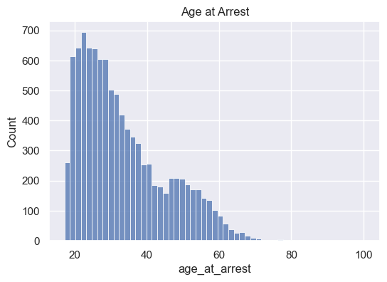

<p align="center">
  
</p>

<p align="center">
  
  <a href="https://github.com/gi11ikin/problem-set-4"></a>
</p>

<p align="center"><a href="src/">Plot modules</a> &nbsp; · &nbsp; <a href="data/">Saved figures</a></p>

## Overview

A course visualization exercise using arrest-event data. Modular scripts produce bar charts, histograms, categorical comparisons, and scatterplots to examine distributions and relationships in model predictions.

This repository is a personal fork of [the original course repository](https://github.com/gi11ikin/problem-set-4). The original instructions are retained below.



*Existing project output; not regenerated for this README update.*

## At a glance

| Area | What to look for |
| --- | --- |
| **Prepare** | Transform the source tables and derive features used by the plots. |
| **Visualize** | Use several chart types to compare groups, distributions, and predictions. |
| **Discuss** | Pair saved figures with the exercise’s printed interpretations and questions. |

## Start here

From the repository root, in an activated environment:

```sh
pip install -r requirements.txt
python main.py
```

## Scope

The figures are coursework outputs. Visual comparisons alone do not establish fairness, causality, or suitability for individual decisions. The original guide below retains its supplied “Problem Set #2” heading.

---

<details>
<summary><strong>Original course instructions</strong></summary>

PROBLEM SET #2: PLOTS

Instructions:
- Clone the Problem Set code package from GitHub:
- Remember to spend some time to get to know the data before you start on pre-processing and analysis
- Run `pip install -r requirements.txt`
- Run main.py and then work through each of the five PARTS of the Problem Set

Before you start:
- Make sure to setup a virtual environment as discussed in the Course Tech Setup lecture. Here's a short article as an additional resource: https://www.freecodecamp.org/news/python-requirementstxt-explained/
- Don't forget to set your requirements.txt file using pip freeze > requirements.txt

When you're done:
- Commit and push this code package to your GitHub account
    - A good practice is to use simple commit comments and commit code after you've finished each feature. Commit and push often.

Submission: You will submit the GitHub URL for this repo in ELMS

Grading: We will look to make sure you've output the correct PNGs and print statements. We will only run main.py, so make sure to stucture this correctly. Credit will be given for adhering to the course's Code Standards and Data Standards, using GitHub correctly, and producing the correct output, among other considerations.

</details>
