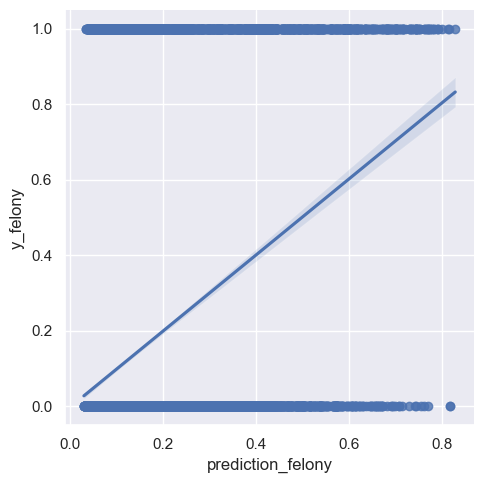

# Visualizing Arrest Data and Model Predictions

A coursework exploration of distributions, group comparisons, and model calibration using pandas, Seaborn, and Matplotlib. The plots put predicted rearrest probabilities beside observed outcomes so their relationship can be examined.

## My contribution

I extended the [course starter](https://github.com/gi11ikin/problem-set-4) with bar charts, histograms, categorical comparisons, scatter plots, and written interpretations. The repository retains the instructor's plotting examples and assignment instructions.

This is an existing committed output from the exercise. It is not a new evaluation, and the fitted line alone does not establish model calibration or fairness.

## Explore or run

Browse [saved plots](data/) or start with [the main program](main.py). To reproduce them, create a fresh Python environment, install `requirements.txt`, and run `python main.py` from the repository root. The ETL stage downloads the course datasets from Dropbox; it needs network access even though plot images are already included.

These analyses concern recorded arrest data and classroom predictions. They are not validated for decisions about individuals.

Original course assignment

PROBLEM SET #2: PLOTS

Instructions:
- Clone the Problem Set code package from GitHub:
- Remember to spend some time to get to know the data before you start on pre-processing and analysis
- Run `pip install -r requirements.txt`
- Run main.py and then work through each of the five PARTS of the Problem Set

Before you start:
- Make sure to setup a virtual environment as discussed in the Course Tech Setup lecture. Here's a short article as an additional resource: https://www.freecodecamp.org/news/python-requirementstxt-explained/
- Don't forget to set your requirements.txt file using pip freeze > requirements.txt

When you're done:
- Commit and push this code package to your GitHub account
    - A good practice is to use simple commit comments and commit code after you've finished each feature. Commit and push often.

Submission: You will submit the GitHub URL for this repo in ELMS

Grading: We will look to make sure you've output the correct PNGs and print statements. We will only run main.py, so make sure to stucture this correctly. Credit will be given for adhering to the course's Code Standards and Data Standards, using GitHub correctly, and producing the correct output, among other considerations.

---

## Author

**Kenneth Yeaher**  
Master of Information Management  
University of Maryland, College Park  

`Python` · `Data Visualization`
